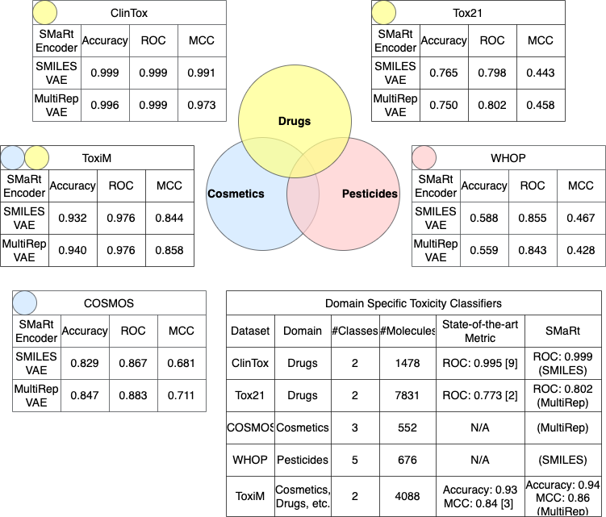
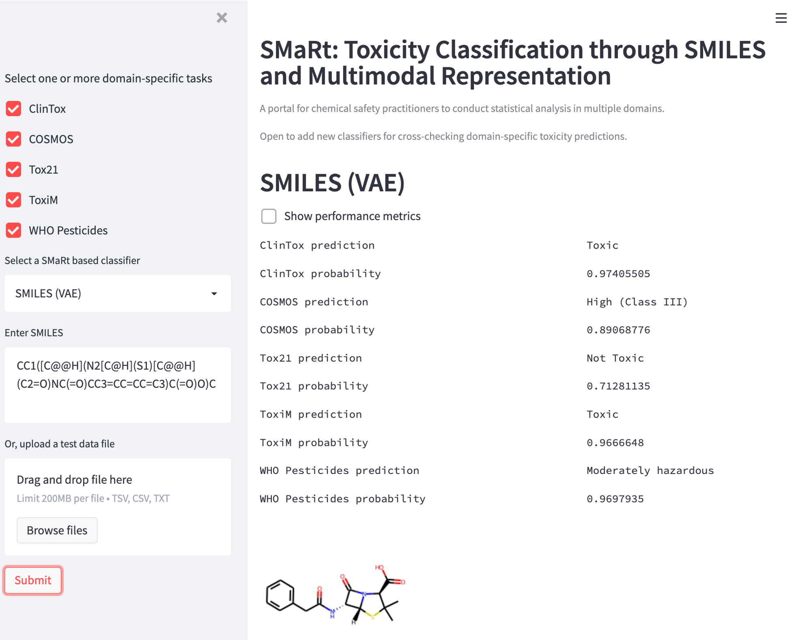

## SMaRt
### SMaRt: A Toxicity Classification System through SMILES and Multimodal Representation to Cross-check Hazardous Chemicals

Predicting toxicity of molecules has many real-world applications. It’s used in not only medicine, but also the personal care industry as an alternative method to animal testing when screening cosmetic ingredients, and the agrochemical discovery field when testing pesticides. However, currently computational toxicology is reliant on human-driven feature engineering and isolated to singular domains. This is often driven by either commercial interest – the pharmaceutical industry spent $83 billion dollars on R&D in 2019, or regulatory pressure – animal testing for cosmetic products has been prohibited in the EU since 2009. As of now, there does not exist a general-purpose toxicity classification system.

The objective of this project is to develop a toxicity classification system that uses multiple molecular representations as input to learn the “secret” of each molecule that works well in the seemingly disjoint domains of drugs, cosmetics, and pesticides. Specifically, SMaRt (SMILES and Multimodal Representation) investigates the viability of learning a low-dimensional domain agnostic feature representation through pretraining variational autoencoders (VAE) using large unlabeled dataset of SMILES sequences and 2D molecular drawings. The final product must fulfill the need for a multi-domain computational toxicology tool, such that new domains that are currently constrained by resources and expert knowledge can be explored using SMaRt encoders.

Performance of toxicity classification models built upon SMaRt encoders is consistent with existing research and comparable to other state-of-the-art baselines in drugs and cosmetics. 2D representation of molecules has been used independently to train toxicity classification models. SMaRt combines both representations in pretraining VAE and shows improvement over using SMILES alone. The SMaRt UI dashboard is a one-stop portal that allows users to compare the predictions of multiple domain specific classifiers. It reduces the friction for experts from different domains to compare notes and conduct statistical analysis.

Knowledge fragmentation has long been a problem in computational toxicology. By developing a toxicity classification system that can predict the toxicity of multi-domain chemicals without relying on specialized chemistry knowledge, this project can provide a novel and sustainable toxicity screening method and allow cross-domain analysis of chemicals. The impact of the project is not only to protect animals by eliminating empirical toxicity testing, but also to benefit humans by improving the efficiency of preclinical testing and producing safer industrial chemicals.

### Results


### Build docker image
```bash
docker build -t cool-mmm .
```

### Run docker process
```bash
docker run --rm -d -p 8501:8501 -v `pwd`:/app/mmm -w /app/mmm/src --shm-size=10g -u `id -u`:`id -g` \
-e PYTHONPATH=/app/mmm/src cool-mmm streamlit run smart_demo.py
```
Then SMaRt UI dashboard can be accessed at http://127.0.0.1:8501:


